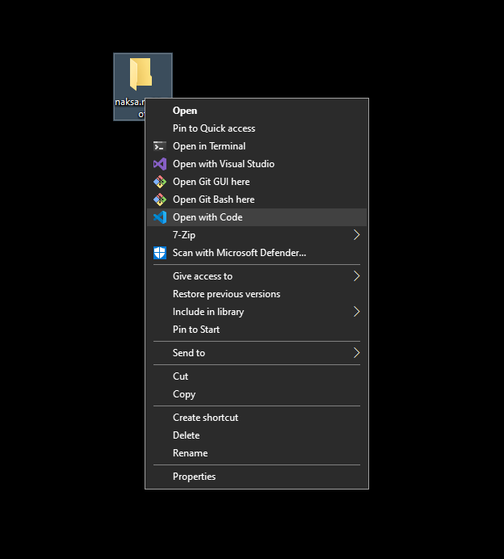

# Description

Welcome to DOT.COM, your one-stop destination for all PC hardware needs. Specializing in a wide array of PC components, we cater to both enthusiasts and professionals seeking high-quality, reliable parts for building and upgrading computers. 
Our inventory includes a diverse range of products, from cutting-edge processors and high-performance graphics cards to efficient cooling solutions and robust storage options.

# Table of Contents

- [Installation](#installation)
- [Usage](#usage)
- [Features](#features)
- [Contributing](#contributing)
- [Credits](#credits)
- [License](LICENSE)

# Installation 

Follow these steps to set up and run the online shop project on your local machine.  
Ensure you have Visual Studio Code and Git installed in your computer before you begin.

## Prerequisites

- **Visual Studio Code**
- **Git**

## Clone the Repository

First, clone the project repository to your local machine:

```bash
git clone https://github.com/jagualv/naksa.ns88-dot.git
```
#### Usage example from CLI  
- To open the cloned repository, it is necessary to have previously added the Visual Studio Code binary as an environment variable in the **PATH** of your operating system.
```bash
cd naksa.ns88-dot
code .
````

# Usage

- Brief demostration of how to open the project **_naksa.ns88-dot_** using the User Graphical Interface in Windows
  



# Features

- **User-friendly interface**
- **Add to Cart your products**
- **Responsive design for mobile and desktop**
- **Developed with HTML, CSS, JS & Bootstrap**

# Contributing 

We warmly welcome contributions from the community and are thrilled to have interest from MSMK University and Open-Source Developer users.

#### General Guidelines

- **Code Standards:** Ensure your code adheres to the project's coding standards.
- **Documentation:** Update or add documentation as needed.
- **Testing:** Write tests for your code to ensure reliability and prevent regressions.
- **Respectful Collaboration:** Always engage respectfully with other contributors.

# Credits

This project would not have been possible without the valuable contributions and support from a number of individuals developers. We extend our heartfelt thanks to all who have helped make this project a success.

### Developers

- **jagualv**
- **unknown.naksa-devUser**

### Special thanks 

A special thanks to **unknown.naksa-devUser**, whose guidance and support were instrumental in the development of this project.
